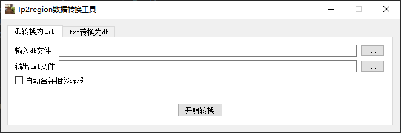
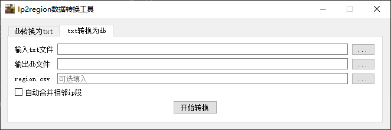
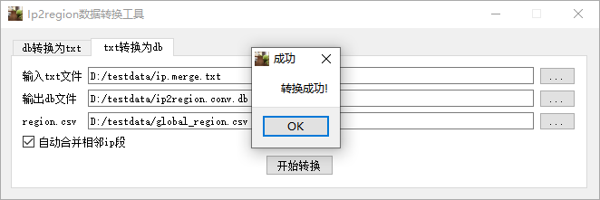

# ip2region 数据转换工具
  * 来源项目: https://github.com/lionsoul2014/ip2region
  * 支持 txt -> db, db -> txt
  * 支持 region.csv 计算城市id
  * 支持合并相邻的ip段, 如果相邻ip段的地址信息相等,则合并
# 下载地址:
  * https://github.com/orestonce/Ip2regionTool/releases

## 程序运行截图

