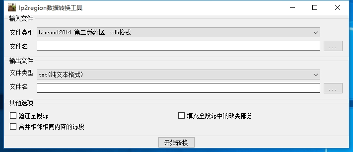

# ip2region 数据转换工具
  * 来源项目: https://github.com/lionsoul2014/ip2region
  * 支持的数据格式
    * 读写：txt,纯文本格式
    * 读写：Linsoul2014v1, Linsoul2014第一版db格式
    * 读写：Linsoul2014v2, Linsoul2014 第二版xdb格式
    * 读：IpipdnetIpdb, ipip.net的ipdb格式数据
    * 读：Maxmind, maxmind的mmdb格式数据
  * 支持的操作
    * 以上数据格式的互相转换
    * 支持合并相邻的ip段, 如果相邻ip段的地址信息相等,则合并
    * 验证全段ip
    * 填充全段ip中的缺失部分
    * 合并相邻相同内容的ip段
  * 下一步计划 
    * [ ] 支持 ipip.net 的datx格式
    * [ ] Linsoul2014v1 支持 region.csv 计算城市id
    * [ ] Linsoul2014v2 支持2种索引模式 
    * [ ] 合并多个数据库，例如GeoLite2-City.mmdb 和 GeoLite2-ASN.mmdb 合并，得到既有城市信息又有ASN信息的最终数据
  * 输出可执行文件:
    * windows qt 界面
    * windows_x64、linux_x64、darwin_amd64 三种版本的命令行二进制
# 下载地址:
  * https://github.com/orestonce/Ip2regionTool/releases
  
## 程序运行截图

