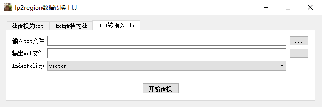

# ip2region 数据转换工具
  * 来源项目: https://github.com/lionsoul2014/ip2region
  * 旧版的db数据格式:
    * 支持 txt -> db, db -> txt
    * 支持 region.csv 计算城市id
    * 支持合并相邻的ip段, 如果相邻ip段的地址信息相等,则合并
  * 新版的 [xdb](https://mp.weixin.qq.com/s?__biz=MzU4MDc2MzQ5OA==&mid=2247483696&idx=1&sn=6e9e138e86cf18245656c54ff4be3129&chksm=fd50ab35ca2722239ae7c0bb08efa44f499110c810227cbad3a16f36ebc1c2afc58eb464a57c#rd) 数据格式
    * 支持 txt -> xdb, 包括2种索引模式
    * 支持 xdb -> txt
  * 二进制需要的运行环境:
    * 提供windows_386、linux_386、darwin_amd64 三种版本的命令行二进制
    * 提供 windows Qt界面的二进制, 使用qt5.6/go1.12.17编译, 支持windows xp运行二进制  
# 下载地址:
  * https://github.com/orestonce/Ip2regionTool/releases
  
## 程序运行截图

* TODO
  * [ ] ipip.net 数据格式支持 *.ipx *.ipdb
  * [ ] geoip 数据格式支持 
